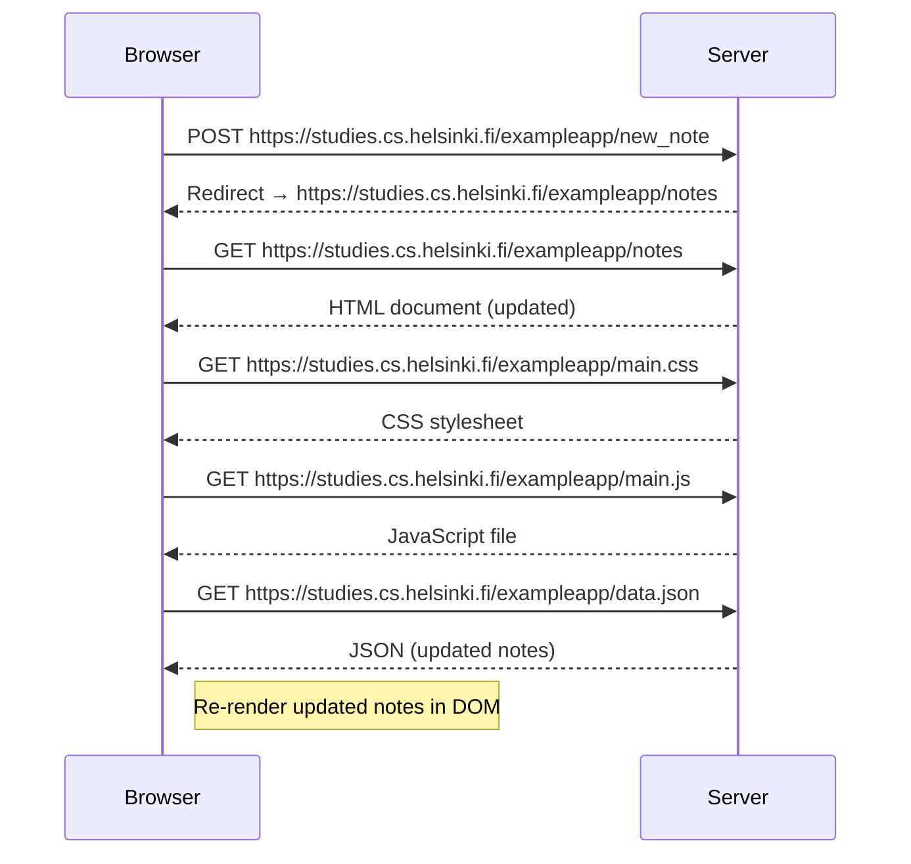

```mermaid
sequenceDiagram
    participant User as  Browser
    participant Server as Server

    %% Adding a new note
    User->>Server: POST https://studies.cs.helsinki.fi/exampleapp/new_note
    Server-->>User: Redirect → https://studies.cs.helsinki.fi/exampleapp/notes

    %% After note submission
    User->>Server: GET https://studies.cs.helsinki.fi/exampleapp/notes
    Server-->>User: HTML document (updated)

    User->>Server: GET https://studies.cs.helsinki.fi/exampleapp/main.css
    Server-->>User: CSS stylesheet

    User->>Server: GET https://studies.cs.helsinki.fi/exampleapp/main.js
    Server-->>User: JavaScript file

    User->>Server: GET https://studies.cs.helsinki.fi/exampleapp/data.json
    Server-->>User: JSON (updated notes)
    Note right of User: Re-render updated notes in DOM

```