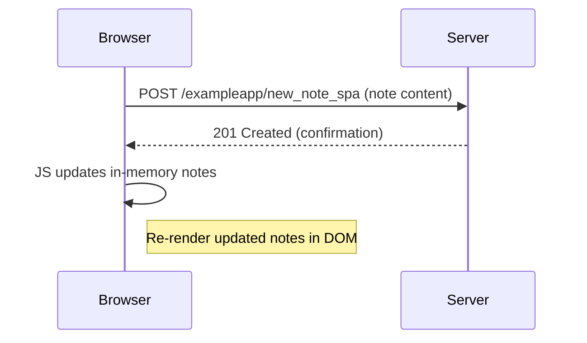

```mermaid
sequenceDiagram
    participant User as  Browser
    participant Server as Server
%% Adding a new note (SPA style)
    User->>Server: POST /exampleapp/new_note_spa (note content)
    Server-->>User: 201 Created (confirmation)

    %% No reload, SPA updates UI
    User->>User: JS updates in-memory notes
    Note right of User: Re-render updated notes in DOM

```